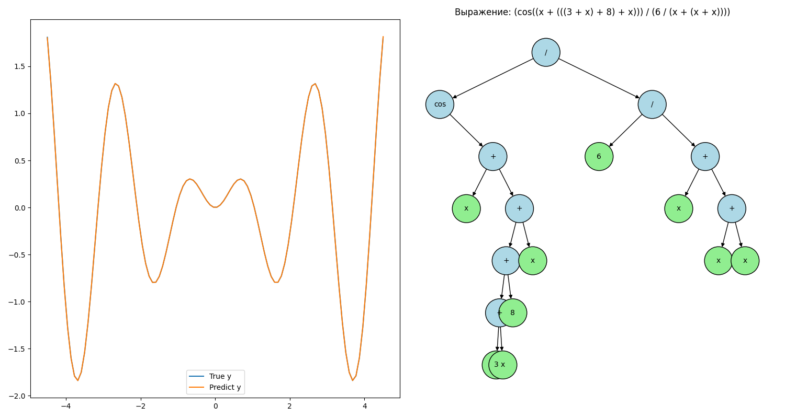

# Genetic Programming for Symbolic Regression

This project is my first attempt at implementing an evolutionary algorithm using standard genetic programming techniques. 
The algorithm is designed to solve a symbolic regression problem by evolving mathematical expressions over generations. 
It applies selection, crossover, and mutation operations to evolve increasingly accurate models.

## Algorithm Description
This implementation is based on the genetic programming algorithm described in:
> Koza, J.R. (1992). Genetic Programming: On the Programming of Computers by Means of Natural Selection. MIT Press.

The algorithm follows the standard genetic programming approach with:
- Tree-based representation of mathematical expressions
- Selection methods for parent choice
- Subtree crossover for genetic material exchange
- Point and subtree mutation for introducing variation
- Ramped half-and-half initialization for diverse initial population

For more details on genetic programming and symbolic regression, see:
- [Genetic programming: An introduction and survey of applications](https://www.researchgate.net/publication/3751687_Genetic_programming_An_introduction_and_survey_of_applications)
- [Symbolic regression](https://en.wikipedia.org/wiki/Symbolic_regression)

## Dependencies

The algorithm is written in [Python 3.11.4](https://www.python.org/) and relies on the following libraries:

- [NumPy 1.25.2](https://numpy.org/) for numerical operations
- [NetworkX 3.4.2](https://networkx.org/) for tree visualization

To install these dependencies, you can use `pip`:

```bash
pip install numpy==1.25.2 networkx==3.4.2
```

## Example
Below is an example usage of the `GeneticProgrammingSymbolRegression` class, which tries to grow the function `f(x) = sin(3 * x) * x * 0.5`.
You can find a complete example in [`example.py`](example.py). Here's a quick overview of how to use the library:

```python
from src.base.gp import GeneticProgrammingSymbolRegression as GP
import matplotlib.pyplot as plt
import numpy as np

def function(x):
    return np.sin(3 * x) * x * 0.5

left_border = -4.5
right_border = 4.5
sample_size = 100

x = np.linspace(left_border, right_border, sample_size)
y = function(x)

gp = GP(
    n_iters=500,
    pop_size=50,
    elitism=None,
    max_depth=5,
    limit_depth=8,
    metric='RMSE',
    selection='tournament_k',
    tour_size=15,
    crossover='standard',
    crossover_rate=1.0,
    mutation='grow',
    mutation_rate=0.45,
    is_const_mut_rate=True,
    is_logging=False,
    show_progress_each=10,
    termination=150,
    random_state=None
)

ind = gp.fit(x, y)
y_pred = ind.genotype() * np.ones(sample_size)

fig, ax = plt.subplots(figsize=(15, 8), ncols=2, nrows=1)
ax[0].plot(x, y, label="True y")
ax[0].plot(x, y_pred, label="Predict y")
ax[0].legend()

ind.plot(ax=ax[1])

plt.tight_layout()
plt.show()
```

## Output
During execution, the algorithm will display the progression of the fitness score (RMSE in this case) over generations. 
Below is an example of how the output might look:
```bash
50-th iteration with the best fitness = 0.29594581743652154
100-th iteration with the best fitness = 0.004285515587553284
150-th iteration with the best fitness = 0.004285515587553274
200-th iteration with the best fitness = 0.004285515587553274
250-th iteration with the best fitness = 0.004285515587553274
```

Final results:
- Best fitness: 0.004285515587553274
- Best solution: `(cos((x + (((3 + x) + 8) + x))) / (6 / (x + (x + x))))`

The visualization below shows:
1. Comparison between the true function (blue) and the predicted function (orange)
2. Tree representation of the best solution found



*Figure 1: Left plot shows the comparison between true and predicted functions. Right plot displays the tree structure of the evolved mathematical expression.*

